# Wise API - Architecture Documentation

> **App:** `apps/wise-api`
> **Framework:** NestJS (v10) with TypeScript
> **Database:** Google Cloud Firestore
> **Build:** Nx monorepo + Webpack
> **Architecture:** Clean Architecture / Domain-Driven Design (DDD)

---

## Table of Contents

1. [Project Overview](#project-overview)
2. [Directory Structure](#directory-structure)
3. [Architecture Layers](#architecture-layers)
4. [Module Overview](#module-overview)
5. [High-Level Architecture Graph](#high-level-architecture-graph)
6. [Request Lifecycle](#request-lifecycle)
7. [Module Dependency Graph](#module-dependency-graph)
8. [Auth Module Flow](#auth-module-flow)
9. [Mentee Module Flow](#mentee-module-flow)
10. [Mentor Module Flow](#mentor-module-flow)
11. [Clean Architecture Layer Graph](#clean-architecture-layer-graph)
12. [Infrastructure Services](#infrastructure-services)
13. [Firestore Collections](#firestore-collections)
14. [Configuration System](#configuration-system)
15. [Lazy Loading Pattern](#lazy-loading-pattern)

---

## Project Overview

Wise API is a mentorship platform backend that connects **Mentors** and **Mentees**. It provides:

- **Authentication** via email/password with JWT sessions stored in Firestore
- **Mentor & Mentee registration** with multi-step registration flows
- **Profile management** including profile pictures via GCS signed URLs
- **LINE Login integration** for social authentication
- **Email service** via SMTP with Handlebars templates
- **Admin management** for platform administrators
- **Master data** management (Faculties, Topics, Industries, Hobbies, Invite Codes)

The API is served at `/api` with Swagger documentation at `/api/explorer` (dev/staging only).

---

## Directory Structure

```
apps/wise-api/src/
|-- main.ts                          # Bootstrap & server startup
|-- app/
|   |-- app.module.ts                # Root NestJS module
|   |-- app.controller.ts            # Health-check controller
|   |-- app.service.ts               # Health-check service
|
|-- config/                          # Environment configuration (registerAs)
|   |-- auth.config.ts
|   |-- firestore.config.ts
|   |-- line.config.ts
|   |-- mail.config.ts
|   |-- mentor.config.ts
|   |-- mentee.config.ts
|   |-- storage.config.ts
|
|-- infrastructure/                  # Shared infrastructure
|   |-- persistence/firestore/
|       |-- firestore.module.ts      # Firestore client provider
|       |-- repositories/
|           |-- firestore-base.repository.ts  # Base repository class
|
|-- modules/                         # Feature modules (DDD bounded contexts)
    |-- auth/                        # Authentication & session management
    |-- mentee/                      # Mentee profiles & registration
    |-- mentor/                      # Mentor profiles & registration
    |-- user/                        # User accounts & profile pictures
    |-- admin/                       # Admin management
    |-- mail/                        # Email service (SMTP)
    |-- storage/                     # File storage (GCS)
    |-- line/                        # LINE Login integration
    |-- master-data/                 # Reference data (faculties, topics, etc.)
```

Each feature module follows the same internal structure:

```
modules/<feature>/
|-- <feature>.module.ts              # Module root
|-- domain/                          # Domain layer (pure business logic)
|   |-- entities/                    # Domain entities (extend Entity<T>)
|   |-- repositories/               # Repository interfaces (ports)
|   |-- enums/                       # Domain enumerations
|   |-- configs/                     # Config type interfaces
|   |-- services/                    # Domain service interfaces
|
|-- application/                     # Application layer (use cases & DTOs)
|   |-- use-cases/                   # Use case implementations
|   |   |-- <use-case>/
|   |       |-- <use-case>.use-case.ts
|   |       |-- <use-case>.use-case.module.ts
|   |-- dtos/                        # Input/Output DTOs with validation
|   |-- <feature>-use-cases.module.ts
|
|-- interface/                       # Interface layer (HTTP controllers)
|   |-- <feature>.interface.module.ts
|   |-- rest/
|   |   |-- controllers/            # REST controllers
|   |   |-- guards/                  # Route guards
|   |   |-- decorators/             # Parameter decorators
|   |   |-- interceptors/           # Request/response interceptors
|   |   |-- pipes/                  # Validation pipes
|   |-- interfaces/rest/            # Controller interface contracts
|
|-- infrastructure/                  # Infrastructure layer (adapters)
    |-- persistence/firestore/
    |   |-- repositories/            # Firestore repository implementations
    |   |-- <feature>-repositories.module.ts
    |-- services/                    # External service implementations
```

---

## Architecture Layers

The project strictly follows **Clean Architecture** with four concentric layers:

| Layer | Location | Responsibility |
|-------|----------|---------------|
| **Domain** | `domain/` | Entities, repository interfaces, enums, config types. Zero framework dependencies. |
| **Application** | `application/` | Use cases (business workflows), DTOs with validation decorators. |
| **Interface** | `interface/` | REST controllers, guards, interceptors, decorators. Framework-specific. |
| **Infrastructure** | `infrastructure/` | Firestore repositories, SMTP mail, GCS storage, HTTP LINE client. |

**Dependency Rule:** Dependencies point inward only. Domain depends on nothing. Infrastructure implements domain interfaces.

---

## Module Overview

| Module | Type | Purpose |
|--------|------|---------|
| **Auth** | Feature | Email/password login, JWT token issuance, session validation, logout |
| **Mentee** | Feature | Mentee registration, profile retrieval, role-based guard |
| **Mentor** | Feature | Mentor registration, profile retrieval, role-based guard |
| **User** | Support | User account persistence, profile picture management |
| **Admin** | Feature | Admin entity and persistence (currently minimal) |
| **Mail** | Infrastructure | SMTP email sending with Handlebars templates |
| **Storage** | Infrastructure | Google Cloud Storage file operations & signed URLs |
| **Line** | Infrastructure | LINE Login OAuth2 token exchange |
| **Master Data** | Support | Reference data: faculties, topics, industries, hobbies, invite codes |

---

## High-Level Architecture Graph

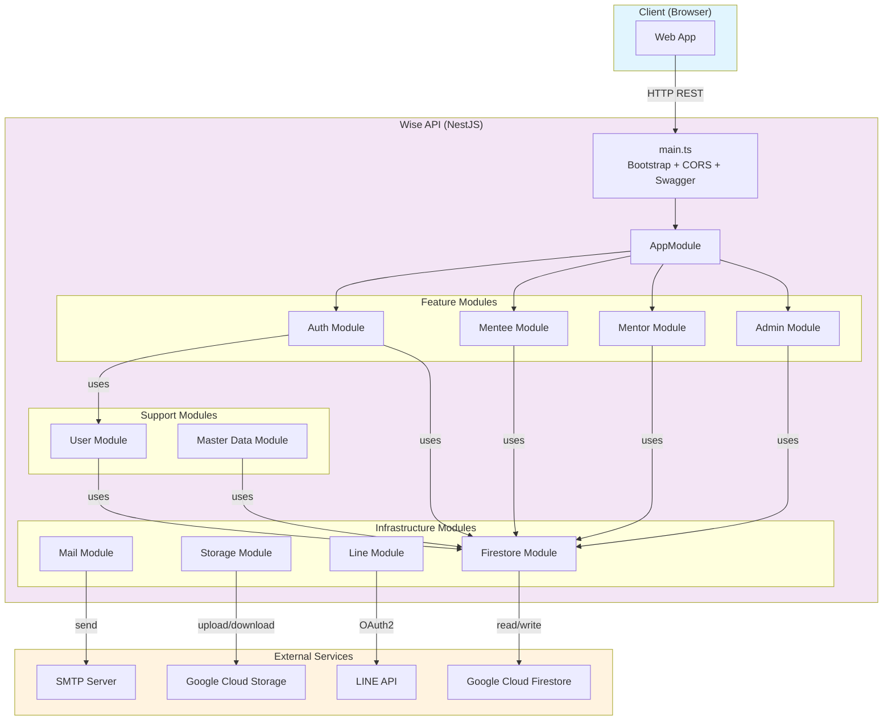

---

## Request Lifecycle

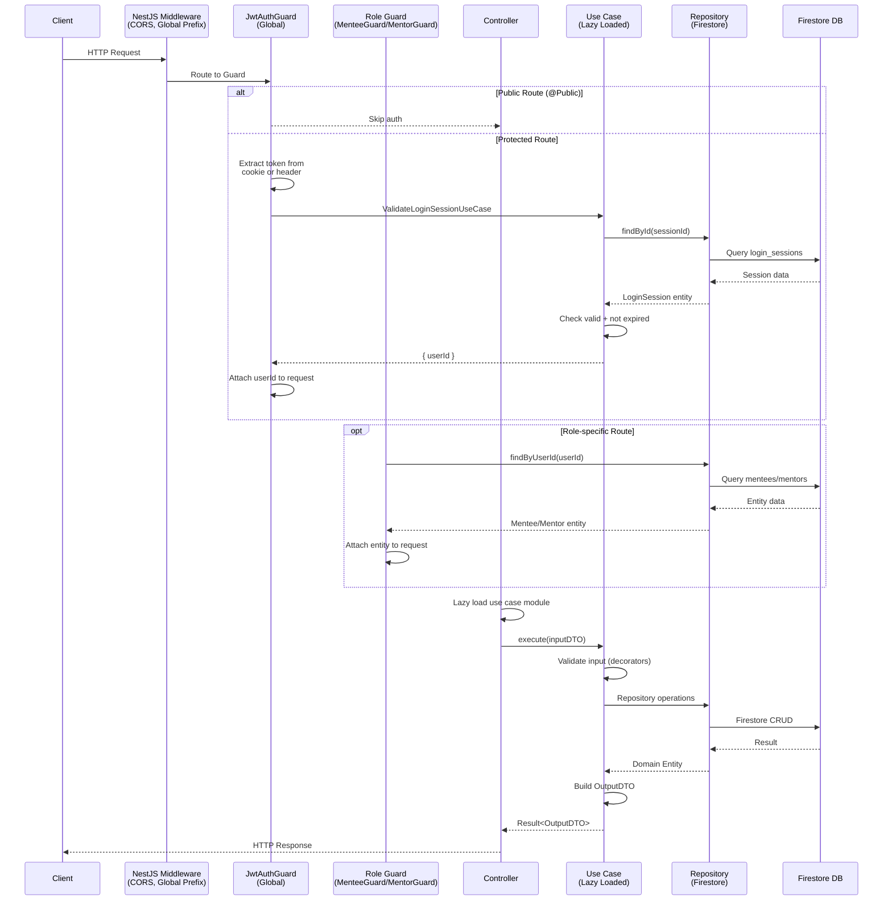

---

## Module Dependency Graph

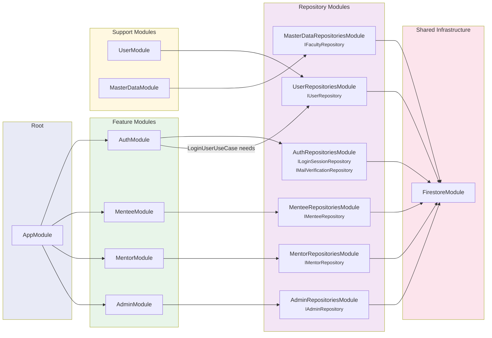

---

## Auth Module Flow

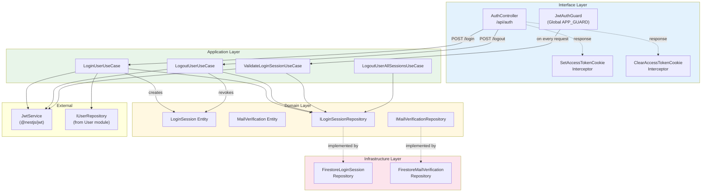

### Auth Endpoints

| Method | Path | Auth | Description |
|--------|------|------|-------------|
| `POST` | `/api/auth/login` | Public | Login with email + password, returns JWT in HttpOnly cookie |
| `POST` | `/api/auth/logout` | Public | Revoke current session, clear cookie |

### Auth Flow Detail

1. **Login:** Client sends `{email, password}` -> verify user in Firestore `users` collection -> hash check with argon2 -> create `LoginSession` entity -> store in `login_sessions` -> sign JWT with `{loginSessionId}` -> set `accessToken` HttpOnly cookie
2. **Request Auth:** `JwtAuthGuard` (global) extracts token from cookie/header -> decode JWT -> load `LoginSession` from Firestore -> check not revoked & not expired -> attach `userId` to request
3. **Logout:** Decode JWT (ignore expiration) -> find session -> `loginSession.revoke()` -> save -> clear cookie

---

## Mentee Module Flow

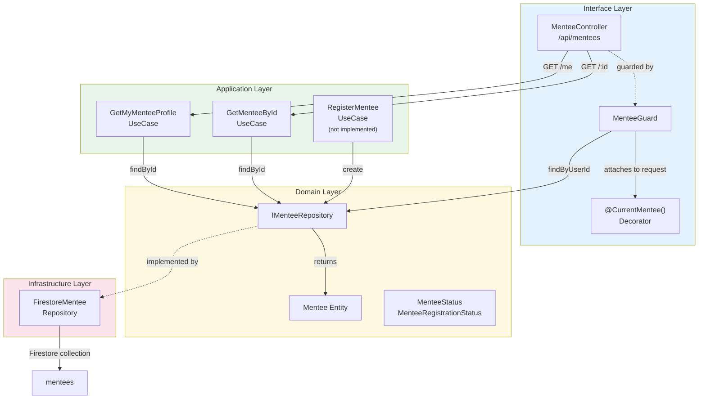

### Mentee Endpoints

| Method | Path | Auth | Guard | Description |
|--------|------|------|-------|-------------|
| `GET` | `/api/mentees/me` | JWT | MenteeGuard | Get own mentee profile |
| `GET` | `/api/mentees/:id` | JWT | - | Get mentee by ID |

---

## Mentor Module Flow

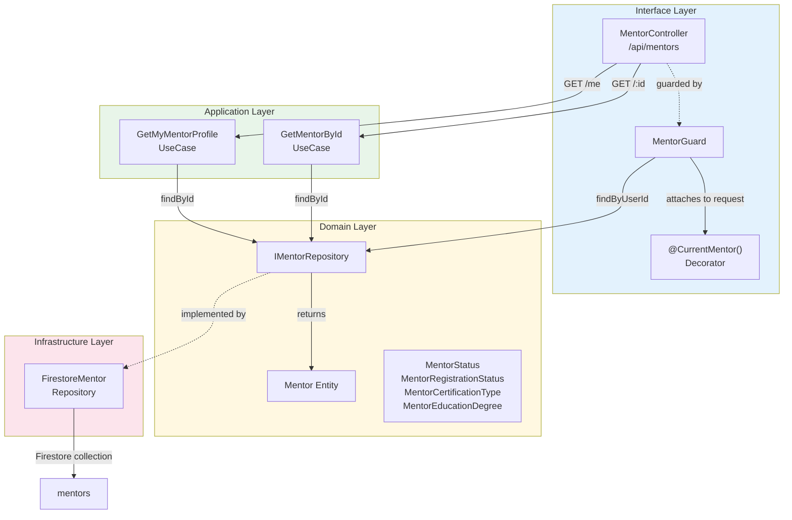

### Mentor Endpoints

| Method | Path | Auth | Guard | Description |
|--------|------|------|-------|-------------|
| `GET` | `/api/mentors/me` | JWT | MentorGuard | Get own mentor profile |
| `GET` | `/api/mentors/:id` | JWT | - | Get mentor by ID |

---

## Clean Architecture Layer Graph

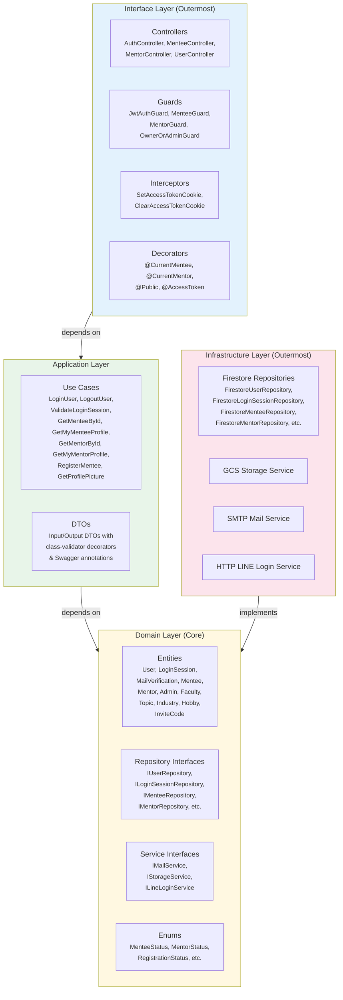

---

## Infrastructure Services

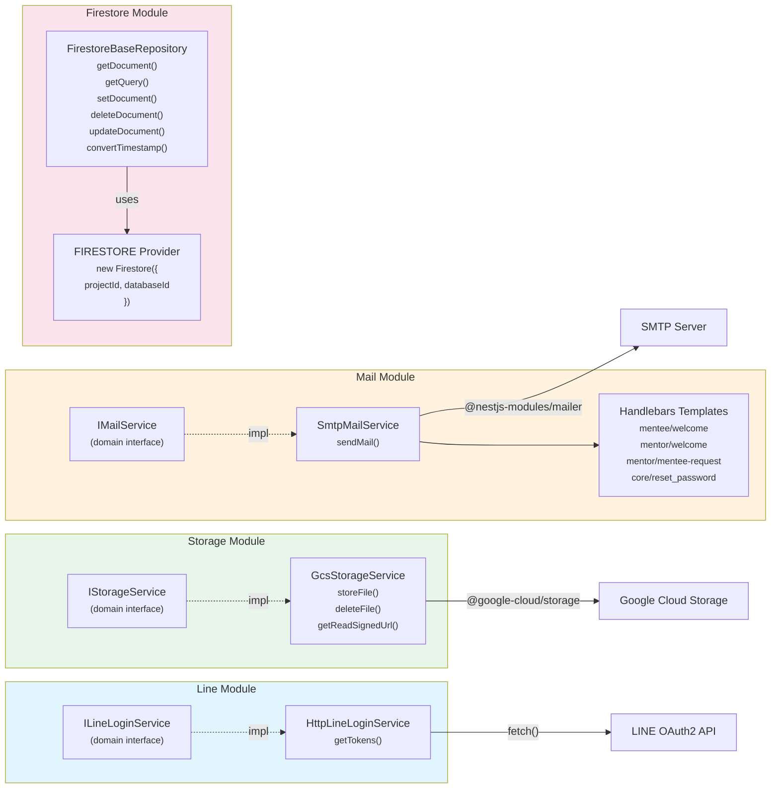

---

## Firestore Collections

| Collection | Used By | Entity | Key Fields |
|------------|---------|--------|------------|
| `users` | UserRepository, AdminRepository | `User`, `Admin` | email, password, type, status, name, contact, line |
| `login_sessions` | LoginSessionRepository | `LoginSession` | userId, createdAt, expiresAt, revoked, revokedAt, lastUsedAt |
| `mail_verifications` | MailVerificationRepository | `MailVerification` | userId, otp, createdAt, expiresAt |
| `mentees` | MenteeRepository | `Mentee` | userId, status, registrationStatus, educationProfile, documents |
| `mentors` | MentorRepository | `Mentor` | userId, invitationCodeId, status, registrationStatus, educations, certificates |
| `faculties` | FacultyRepository | `Faculty` | name (en/th), icon, sortOrder, status |

---

## Configuration System

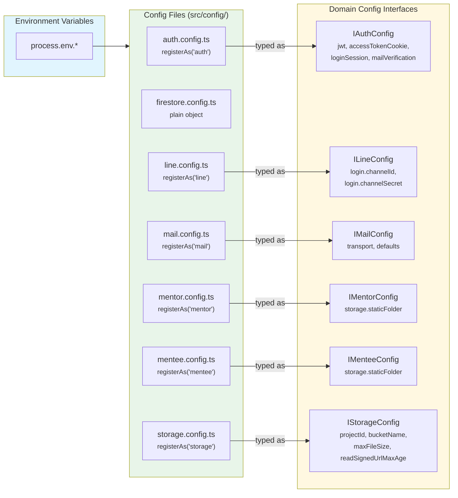

All configs (except `firestore.config.ts`) use NestJS `registerAs()` with `ConfigurationUtils` from `@new-api-core/shared` for type-safe environment variable resolution with defaults.

---

## Lazy Loading Pattern

Use cases are **lazily loaded** at runtime using NestJS `LazyModuleLoader`. Controllers extend `LazyBaseController` from `@new-api-core/interface/nestjs`.

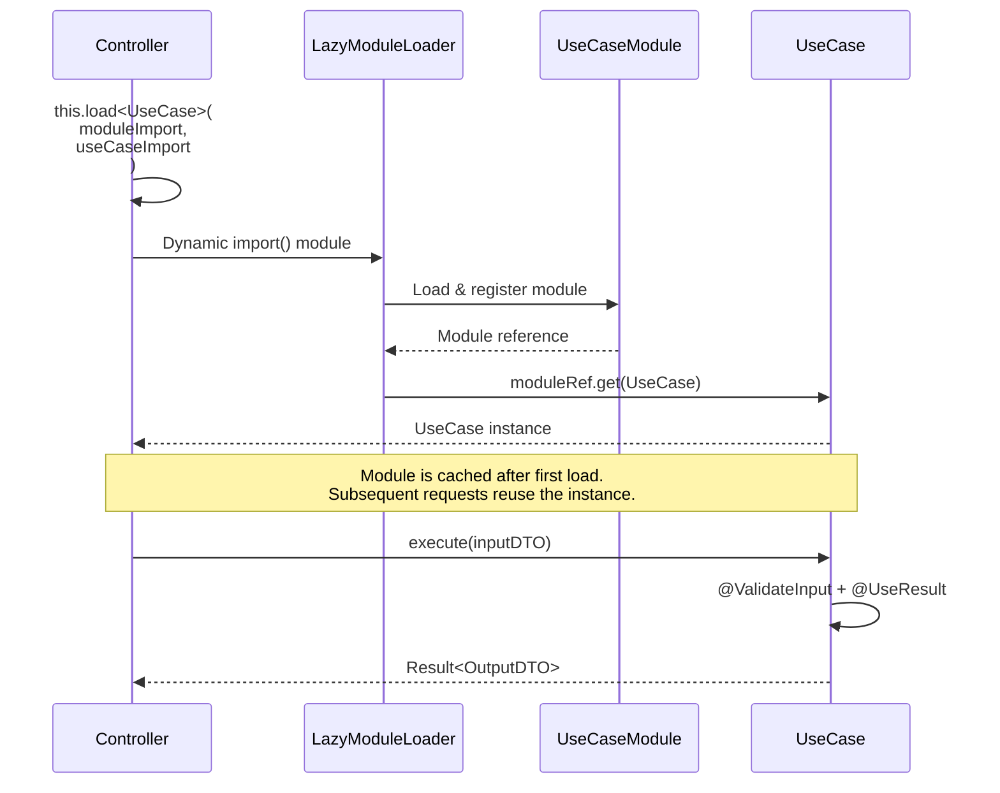

This pattern provides:
- **Reduced startup time:** Modules are loaded on-demand, not at bootstrap
- **Code splitting:** Webpack can split use case modules into separate chunks
- **Memory efficiency:** Unused use cases don't consume memory

The `JwtAuthGuard` also uses this pattern for `ValidateLoginSessionUseCase`, caching the instance after first resolution.

---

## Complete System Flow (End-to-End)

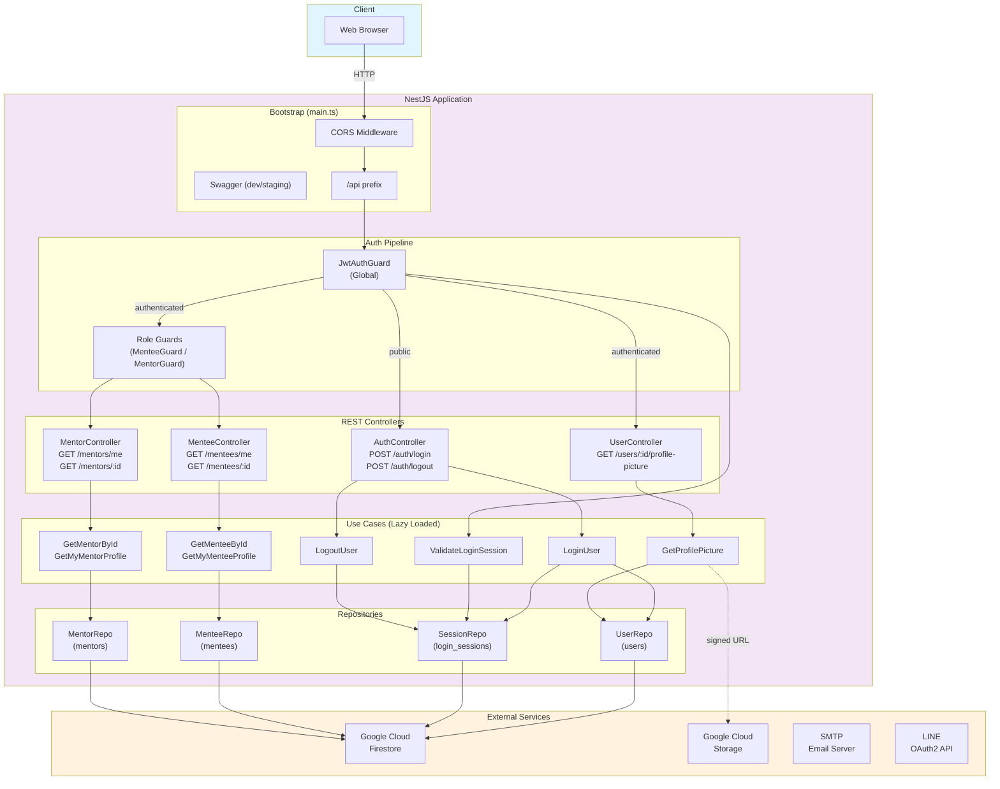
