# Wise API - Architecture Guide

> A beginner-friendly guide to understanding the `apps/wise-api` codebase.
> No prior knowledge of DDD, Clean Architecture, or Firestore required.

---

## Table of Contents

1. [What is this app?](#1-what-is-this-app)
2. [Start Here - Reading Order](#2-start-here---reading-order)
3. [The Big Picture (in plain words)](#3-the-big-picture-in-plain-words)
4. [Concept: What is Firestore?](#4-concept-what-is-firestore)
5. [Concept: What is Clean Architecture?](#5-concept-what-is-clean-architecture)
6. [Concept: What is DDD?](#6-concept-what-is-ddd)
7. [Concept: What is Lazy Loading?](#7-concept-what-is-lazy-loading)
8. [Why is Mentee separate from User?](#8-why-is-mentee-separate-from-user)
9. [How a Request Flows (step by step)](#9-how-a-request-flows-step-by-step)
10. [Module-by-Module Guide](#10-module-by-module-guide)
11. [Folder Pattern Cheat Sheet](#11-folder-pattern-cheat-sheet)
12. [Full System Graph](#12-full-system-graph)

---

## 1. What is this app?

Wise API is the **backend server** for a mentorship platform. Think of it like a school alumni network where:

- **Mentors** (alumni/professionals) sign up to guide students
- **Mentees** (students) sign up to get guidance
- **Admins** manage the platform

The server handles: user registration, login/logout, profile management, file uploads (profile pictures, documents), email notifications, and LINE social login.

**Tech stack:**
- **NestJS** = the web framework (like Express, but with more structure)
- **TypeScript** = the language
- **Firestore** = the database (Google's cloud database)
- **Google Cloud Storage** = file storage (for profile pictures, documents)

---

## 2. Start Here - Reading Order

Don't try to read everything at once. Follow this path:

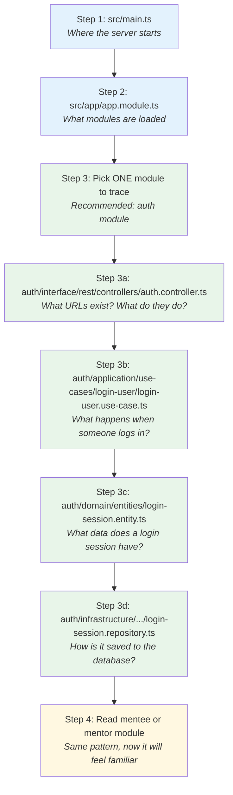

**Key insight:** Every module follows the SAME folder pattern. Once you understand one module (auth), you understand them all.

---

## 3. The Big Picture (in plain words)

Here's what this app looks like, explained simply:

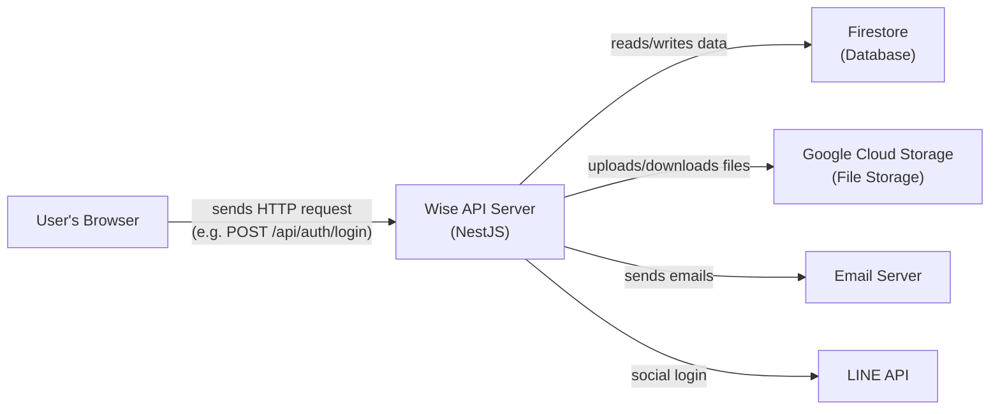

That's it. The browser talks to our server. Our server talks to Google's services.

Inside the server, the code is organized into **modules** — think of them like departments in a company:

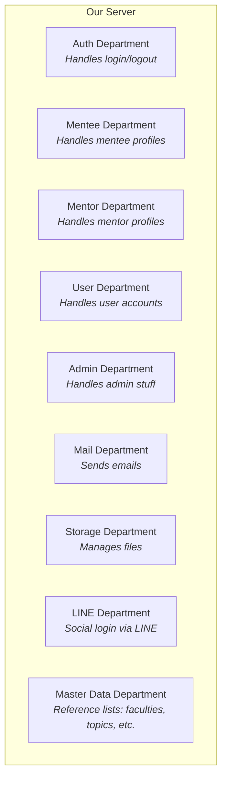

Each department is independent. They have their own folders, their own code, their own database tables. But they can talk to each other when needed (e.g., Auth needs User to verify passwords).

---

## 4. Concept: What is Firestore?

**Firestore** is Google's cloud database. It's a **NoSQL document database** — think of it like a giant JSON file in the cloud.

Instead of tables with rows (like MySQL), Firestore has **collections** with **documents**:

```
Firestore Database
├── users/                          <-- collection (like a folder)
│   ├── user-id-001                 <-- document (like a file)
│   │   ├── email: "alice@mail.com"
│   │   ├── password: "$argon2..."
│   │   └── type: "mentee"
│   └── user-id-002
│       ├── email: "bob@mail.com"
│       └── ...
│
├── login_sessions/
│   └── session-id-001
│       ├── userId: "user-id-001"
│       ├── expiresAt: 2026-08-01
│       └── revoked: false
│
├── mentees/
│   └── mentee-id-001
│       ├── userId: "user-id-001"
│       ├── status: "ACTIVE"
│       └── educationProfile: { ... }
│
├── mentors/
│   └── mentor-id-001
│       ├── userId: "user-id-002"
│       ├── status: "ACTIVE"
│       └── educations: [ ... ]
│
└── faculties/
    └── faculty-id-001
        ├── name: { en: "Engineering", th: "วิศวกรรมศาสตร์" }
        └── icon: "..."
```

In the code, you'll see **Repository** classes that read/write to these collections. That's all a repository does — it's the bridge between your code and the database.

---

## 5. Concept: What is Clean Architecture?

Clean Architecture is just a rule about **who can talk to whom**.

Imagine 4 boxes stacked like a cake:

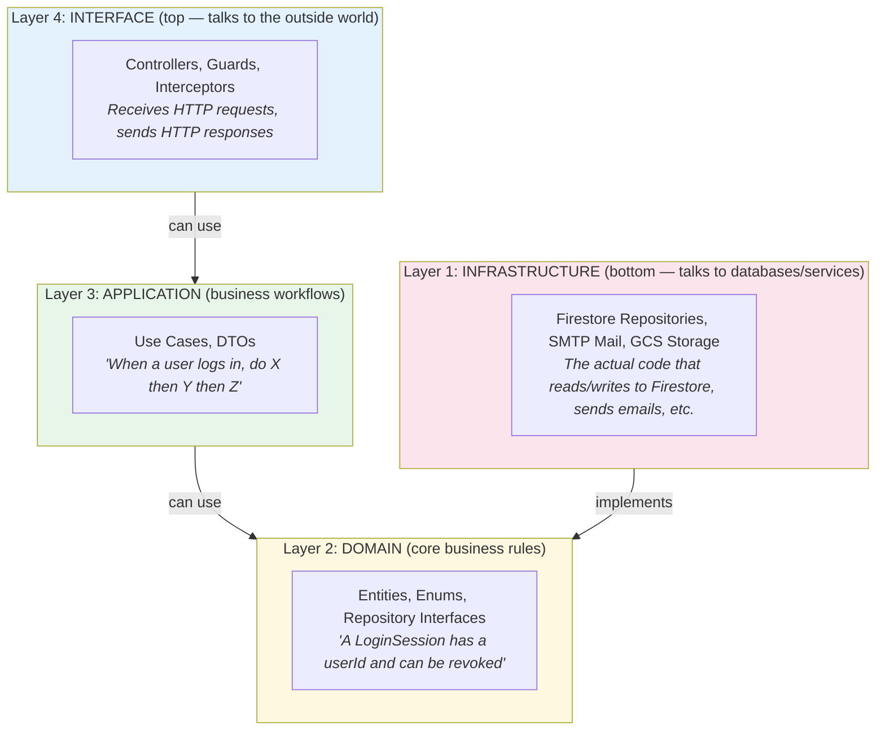

**The ONE rule:** Each layer can ONLY depend on the layer below it. Never upward.

- Controllers (Layer 4) call Use Cases (Layer 3) -- OK
- Use Cases (Layer 3) use Entities (Layer 2) -- OK
- Use Cases (Layer 3) call Controllers (Layer 4) -- FORBIDDEN
- Domain (Layer 2) imports Firestore code (Layer 1) -- FORBIDDEN

**Why?** So you can change the database (e.g., switch from Firestore to PostgreSQL) without touching any business logic. The Domain layer doesn't know or care about Firestore.

**How?** The Domain layer defines **interfaces** (contracts):

```typescript
// Domain says: "I need someone who can do these things"
interface IUserRepository {
  findById(id: string): Promise<User | null>
  findByEmail(email: string): Promise<User | null>
}

// Infrastructure says: "I can do those things using Firestore!"
class FirestoreUserRepository implements IUserRepository {
  async findById(id: string) { /* ... Firestore code ... */ }
  async findByEmail(email: string) { /* ... Firestore code ... */ }
}
```

---

## 6. Concept: What is DDD?

**DDD (Domain-Driven Design)** is a way to organize code around **business concepts** instead of technical concerns.

Instead of organizing by file type:

```
BAD (organized by tech):
├── controllers/
│   ├── auth.controller.ts
│   ├── mentee.controller.ts
│   └── mentor.controller.ts
├── services/
│   ├── auth.service.ts
│   └── mentee.service.ts
└── models/
    ├── user.model.ts
    └── mentee.model.ts
```

DDD organizes by **business domain** (what the business cares about):

```
GOOD (organized by domain):
├── modules/
│   ├── auth/           <-- everything about authentication
│   │   ├── domain/
│   │   ├── application/
│   │   ├── interface/
│   │   └── infrastructure/
│   ├── mentee/         <-- everything about mentees
│   │   ├── domain/
│   │   ├── application/
│   │   ├── interface/
│   │   └── infrastructure/
│   └── mentor/         <-- everything about mentors
```

**Why?** When someone says "change how mentee registration works," you go to `modules/mentee/` and everything you need is there. You don't have to hunt across 10 different folders.

Key DDD terms used in this project:

| Term | What it means | Example in this project |
|------|--------------|------------------------|
| **Entity** | A thing with an identity | `User`, `Mentee`, `Mentor`, `LoginSession` |
| **Repository** | Where entities are stored/retrieved | `IUserRepository`, `IMenteeRepository` |
| **Use Case** | A business action | `LoginUserUseCase`, `GetMenteeByIdUseCase` |
| **DTO** | Data shape for input/output | `LoginUserInputDTO { email, password }` |
| **Bounded Context** | A boundary around related concepts | Each module is a bounded context |

---

## 7. Concept: What is Lazy Loading?

Normally in NestJS, when the server starts, it loads ALL code into memory — even code that nobody has requested yet.

**Lazy loading** means: "Don't load this code until someone actually needs it."

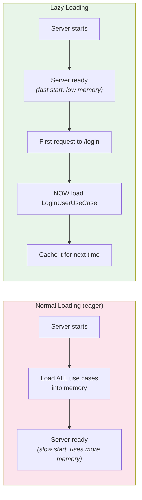

In the code, it looks like this:

```typescript
// In the controller:
async login(@Body() body: LoginUserInputDTO) {
  // This LAZY LOADS the use case the first time it's called
  const loginUserUseCase = await this.load<LoginUserUseCase>(
    () => import('.../login-user.use-case.module'),  // load the module
    () => import('.../login-user.use-case')           // get the use case from it
  )

  return loginUserUseCase.execute(body)
}
```

**Why?** Faster server startup. If nobody ever calls the mentee endpoints, that code is never loaded. Especially useful when the app has many modules.

---

## 8. Why is Mentee separate from User?

This is the most important design question. Here's why:

### The design: User + Mentee/Mentor are SEPARATE entities

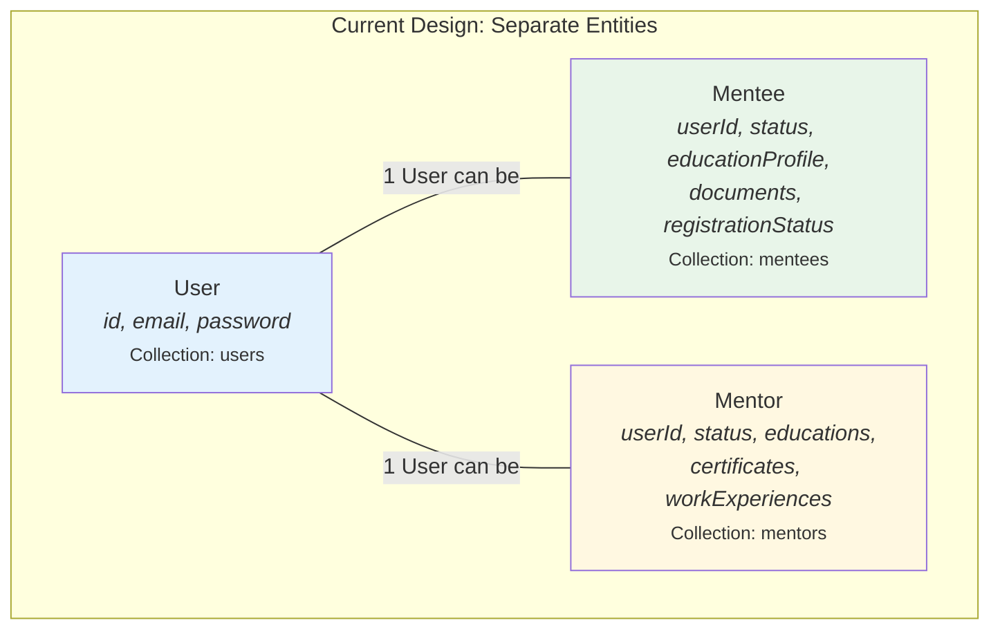

### Why not just extend User? (class Mentee extends User)

You might think:

```typescript
// "Why not just do this?"
class Mentee extends User {
  educationProfile: EducationProfile
  documents: MenteeDocuments
  // ...
}
```

Here are the reasons this project chose NOT to do that:

#### Reason 1: A User can be BOTH a Mentor AND a Mentee

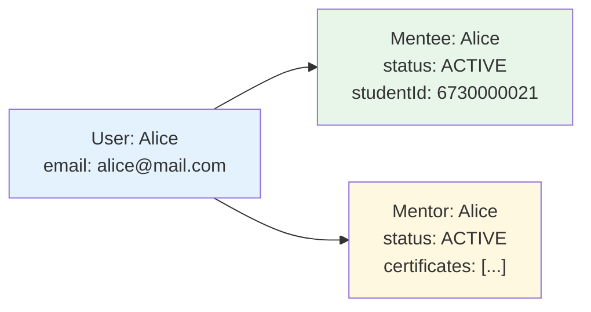

If Mentee extended User, Alice would need TWO User objects with the same email — that's messy. With separate entities, Alice has ONE User record and both a Mentee AND Mentor record pointing to it via `userId`.

#### Reason 2: Different lifecycles

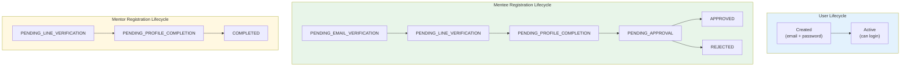

User registration is simple (email + password). But Mentee registration has 6 steps! And Mentor registration has a different 3-step flow. These are completely different processes — mixing them into one class would make it very complex.

#### Reason 3: Different data shapes

| User | Mentee | Mentor |
|------|--------|--------|
| email | educationProfile | invitationCodeId |
| password | documents (citizenIdCard, resume, transcript) | educations[] |
| | referralSource | certificates[] |
| | facultyId, studentId | currentWorkExperiences[] |
| | | previousWorkExperiences[] |
| | | hobbies[], mentoringTopicsIds[] |

These are vastly different data models. Forcing them into one inheritance tree would create a "god object" with dozens of nullable fields.

#### Reason 4: Separate Firestore collections

In Firestore, each entity type has its own collection. This means:
- `users` collection = login credentials only (fast auth queries)
- `mentees` collection = mentee-specific data (no irrelevant fields)
- `mentors` collection = mentor-specific data

This is more efficient for queries and keeps each collection clean.

#### Summary

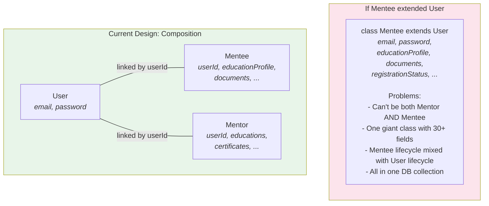

---

## 9. How a Request Flows (step by step)

Let's trace what happens when a mentee opens their profile page (`GET /api/mentees/me`):

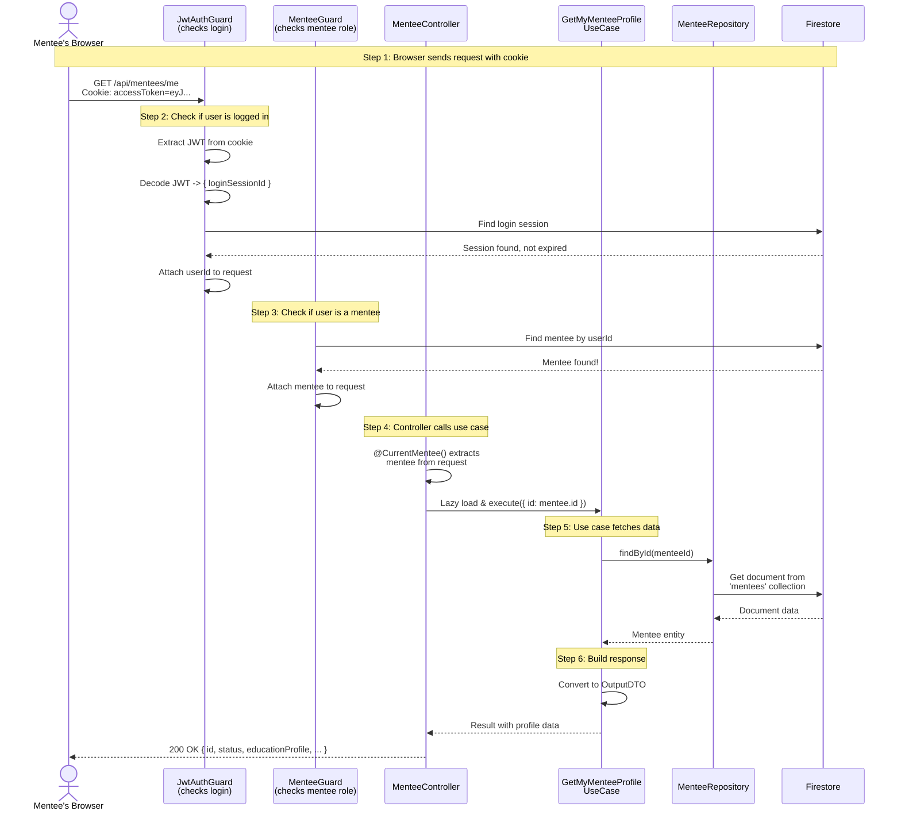

### The same flow, simplified

```
Browser
  |
  v
[JwtAuthGuard] -- "Are you logged in?" -- checks cookie + Firestore session
  |
  v
[MenteeGuard] -- "Are you a mentee?" -- checks Firestore mentees collection
  |
  v
[MenteeController] -- "What do you want?" -- routes to the right use case
  |
  v
[GetMyMenteeProfileUseCase] -- "Let me get your data" -- calls repository
  |
  v
[FirestoreMenteeRepository] -- "Here's the Firestore query" -- talks to DB
  |
  v
[Firestore] -- returns data -- back up the chain -- HTTP response to browser
```

---

## 10. Module-by-Module Guide

### Auth Module (start here!)

**What it does:** Handles login, logout, and checking if a user is logged in.

**Files to read (in order):**

| Order | File | What you'll learn |
|-------|------|-------------------|
| 1 | `modules/auth/interface/rest/controllers/auth.controller.ts` | What endpoints exist (`POST /login`, `POST /logout`) |
| 2 | `modules/auth/application/use-cases/login-user/login-user.use-case.ts` | The login logic: find user -> check password -> create session -> sign JWT |
| 3 | `modules/auth/domain/entities/login-session.entity.ts` | What a session looks like: userId, expiresAt, revoked |
| 4 | `modules/auth/interface/rest/guards/jwt-auth.guard.ts` | How EVERY request gets authenticated |
| 5 | `modules/auth/interface/rest/interceptors/set-access-token-cookie.interceptor.ts` | How the JWT gets stored in a browser cookie |

**How login works:**

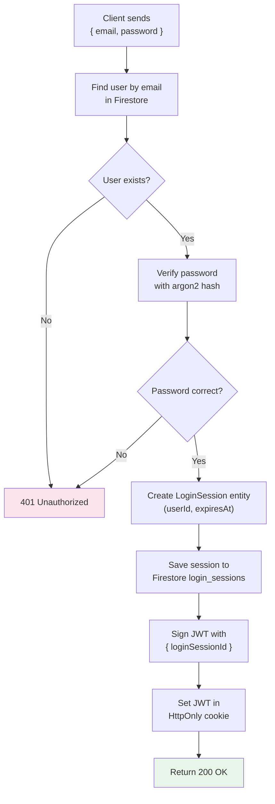

---

### Mentee Module

**What it does:** Manages mentee profiles and registration.

**Files to read:**

| Order | File | What you'll learn |
|-------|------|-------------------|
| 1 | `modules/mentee/interface/rest/controllers/mentee.controller.ts` | Endpoints: `GET /mentees/me`, `GET /mentees/:id` |
| 2 | `modules/mentee/interface/rest/guards/mentee.guard.ts` | How it checks "is this user a mentee?" |
| 3 | `modules/mentee/domain/entities/mentee.entity.ts` | What a Mentee looks like (status, documents, education) |
| 4 | `modules/mentee/domain/enums/mentee.enum.ts` | Registration steps (PENDING_EMAIL -> ... -> APPROVED) |

---

### Mentor Module

**What it does:** Same pattern as Mentee, but for mentors.

**Files to read:**

| Order | File | What you'll learn |
|-------|------|-------------------|
| 1 | `modules/mentor/interface/rest/controllers/mentor.controller.ts` | Endpoints: `GET /mentors/me`, `GET /mentors/:id` |
| 2 | `modules/mentor/domain/entities/mentor.entity.ts` | What a Mentor looks like (education, certificates, work experience) |
| 3 | `modules/mentor/domain/enums/mentor.enum.ts` | Registration steps, education degrees, certificate types |

---

### User Module

**What it does:** The base user account (email + password). Used by Auth for login.

**Key file:** `modules/user/domain/entities/user.entity.ts` — currently minimal (just email + password).

---

### Support Modules (Mail, Storage, Line)

These are "utility" modules. Other modules use them when needed.

```mermaid
graph TB
    subgraph Mail["Mail Module"]
        direction LR
        IMailService["IMailService<br/><i>(interface: 'I can send emails')</i>"]
        SmtpMailService["SmtpMailService<br/><i>(implementation: 'I send via SMTP')</i>"]
        Templates["Email Templates<br/><i>welcome, mentee-request,<br/>reset_password</i>"]
        IMailService -.->|"implemented by"| SmtpMailService
        SmtpMailService --> Templates
    end

    subgraph Storage["Storage Module"]
        direction LR
        IStorageService["IStorageService<br/><i>(interface: 'I can store files')</i>"]
        GcsService["GcsStorageService<br/><i>(implementation: 'I use Google Cloud')</i>"]
        IStorageService -.->|"implemented by"| GcsService
    end

    subgraph Line["Line Module"]
        direction LR
        ILineService["ILineLoginService<br/><i>(interface: 'I can do LINE OAuth')</i>"]
        HttpLineService["HttpLineLoginService<br/><i>(implementation: 'I call LINE API')</i>"]
        ILineService -.->|"implemented by"| HttpLineService
    end

    style Mail fill:#fff3e0
    style Storage fill:#e8f5e9
    style Line fill:#e3f2fd
```

---

## 11. Folder Pattern Cheat Sheet

Every module follows the SAME 4-folder structure. Here's a cheat sheet:

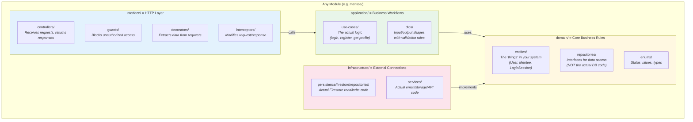

**Quick reference:**
- "Where are the API endpoints?" -> `interface/rest/controllers/`
- "Where is the business logic?" -> `application/use-cases/`
- "What does the data look like?" -> `domain/entities/`
- "Where is the database code?" -> `infrastructure/persistence/firestore/repositories/`

---

## 12. Full System Graph

Everything connected together:

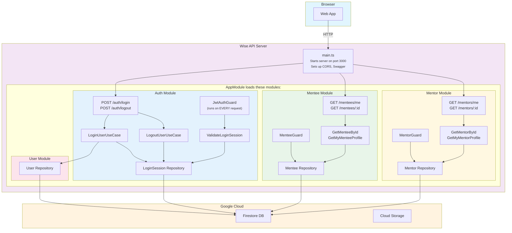

---

## Quick Glossary

| Term | Simple Meaning |
|------|---------------|
| **NestJS** | A framework for building servers in TypeScript (like Express with structure) |
| **Module** | A group of related code (like a department in a company) |
| **Controller** | The code that receives HTTP requests and returns responses |
| **Guard** | A bouncer — blocks requests that don't have permission |
| **Interceptor** | Middleware that can modify the request or response |
| **Use Case** | A single business action (e.g., "log in", "get mentee profile") |
| **DTO** | Data Transfer Object — defines the shape of input/output data |
| **Entity** | A business object with an ID (e.g., User, Mentee) |
| **Repository** | The code that reads/writes entities to/from the database |
| **Firestore** | Google's cloud NoSQL database |
| **JWT** | JSON Web Token — a signed string that proves you're logged in |
| **Lazy Loading** | Loading code only when it's first needed, not at startup |
| **DDD** | Organizing code by business domain (auth, mentee, mentor) |
| **Clean Architecture** | A rule that inner layers can't depend on outer layers |
