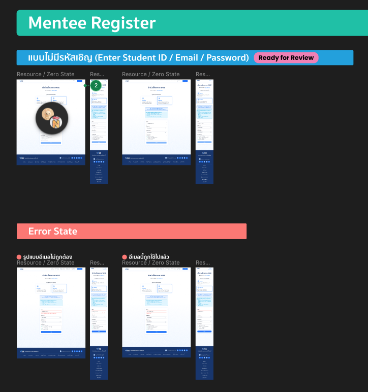
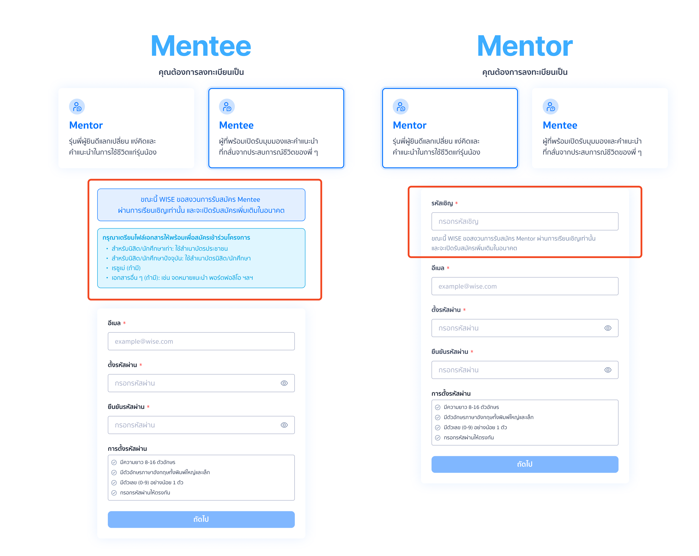

# Note #2 Mentee Account Registration

## Resource
- [Mentee Account Registration #2](https://github.com/SKT-ChAMP/wise-monorepo/issues/2#issue-3890995008)
- [Figma Design File](https://www.figma.com/design/AOlg1BT2bc1Zt4TBtxWLOD/%F0%9F%8E%A8--WISE--Design-File?node-id=1-347)

## Constrain
- Figma file for mentee is still "Ready for Review" state
- This scope does not include email OTP verification itself (handled in the next story).
- LINE binding, identity verification, profile setup, and document upload are not included in this story.
- Invitation codes are not part of the registration process, nor student id

## Scope
Our job in this issue is only in registration step. not including the email OTP verification. However, the mentor registration step is in "ready to dev" state.
- [Figma Design File](https://www.figma.com/design/AOlg1BT2bc1Zt4TBtxWLOD/%F0%9F%8E%A8--WISE--Design-File?node-id=1-347)

## Compare
- Mentee has no invitation input
- Mentee has alert box

## What we have to implement
From the task, they want
- Mentee Account Registration
- Validation Rules
- Password Rules
- Successful Registration Outcome
