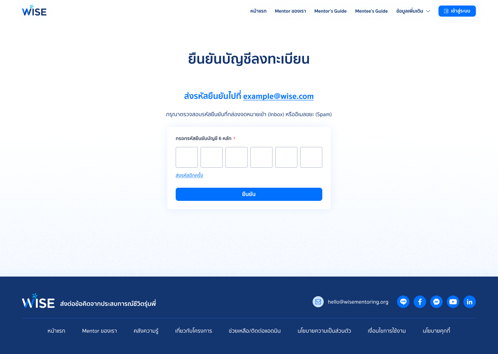

# Note #2 Mentee Account Registration

## Resource
- [Mentee Account Registration #2](https://github.com/SKT-ChAMP/wise-monorepo/issues/2#issue-3890995008)
- [Figma Design File](https://www.figma.com/design/AOlg1BT2bc1Zt4TBtxWLOD/%F0%9F%8E%A8--WISE--Design-File?node-id=1-347)

## Constrain
- Figma file for mentee is still "Ready for Review" state
- This scope does not include email OTP verification itself (handled in the next story).

## Scope
Our job in this issue is only in registration step. not including the email OTP verification. However, the mentor registration step is in "ready to dev" state.

- [Figma Design File](https://www.figma.com/design/AOlg1BT2bc1Zt4TBtxWLOD/%F0%9F%8E%A8--WISE--Design-File?node-id=1-347)




>[!Note]
>OTP page may be made up for mockup or just init layout. it's used for redirect after submit registration

### Out of Scope

- LINE binding, identity verification, profile setup, and document upload are not included in this story.
- Invitation codes are not part of the registration process, nor student id

## Compare
- Mentee has no invitation input
- Mentee has alert box


## What we have to implement

From the task, they want
- Mentee Account Registration
- Validation Rules & Password Rules >> Server/Client Checking
- Successful Registration Outcome >> mentee account state

What we gonna do
- Mentee Account Registration
- Validation Rules & Password Rules >> Server/Client Checking
- Successful Registration Outcome >> mentee account state
- Unit/E2E Test

## Issue Breakdown

Step to implement
Domain (Entity/Interface) -> DTO -> Service -> Repository Impl -> Controller -> Module

>[!Note]
>This below content is ai-generated krub. it's different from what i created in project board.

```
BE Issues (6)                              FE Issues (6)
┌──────────────────────────────┐           ┌──────────────────────────────┐
│ A-1: Mentee Entity + Enum    │           │ A-7: Route + Page Skeleton   │
│ A-2: Repository + Firestore  │           │ A-8: Form UI (Figma)         │
│ A-3: Registration DTOs       │           │ A-9: Password Rules Component│
│ A-4: Password Validation     │           │ A-10: Form Validation Logic  │
│ A-5: Register Use-Case       │           │ A-11: API Client + Hook      │
│ A-6: Controller + Swagger    │           │ A-12: Integration + Errors   │
└──────────────────────────────┘           └──────────────────────────────┘
```


### Summary Table

| Issue | Layer | Description | Blocked By | Estimate |
|-------|-------|-------------|------------|----------|
| A-1 | BE Domain | Mentee Entity + Status Enum | None | Small |
| A-2 | BE Infra | Repository Interface + Firestore | A-1 | Small–Med |
| A-3 | BE App | Registration DTOs (Input/Output) | None | Small |
| A-4 | BE App | Password Validation Rules | A-3 | Small |
| A-5 | BE App | Register Mentee Use-Case | A-2, A-4 | Medium |
| A-6 | BE Interface | REST Controller + Swagger | A-5, A-3 | Small |
| A-7 | FE Structure | Route + Page Skeleton + Layout | None | Small |
| A-8 | FE UI | Registration Form (Figma match) | A-7 | Medium |
| A-9 | FE UI+Logic | Password Rules Checklist Component | A-8 | Small–Med |
| A-10 | FE Logic | Form Validation (react-hook-form) | A-8, A-9 | Small |
| A-11 | FE Integration | Orval Codegen + Mutation Hook | A-6 (deployed) | Small |
| A-12 | FE Integration | Form Submit + Errors + Loading | A-10, A-11 | Medium |
