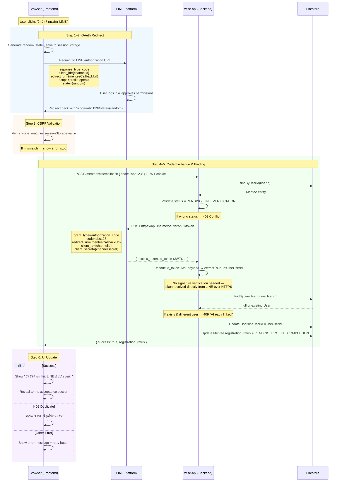
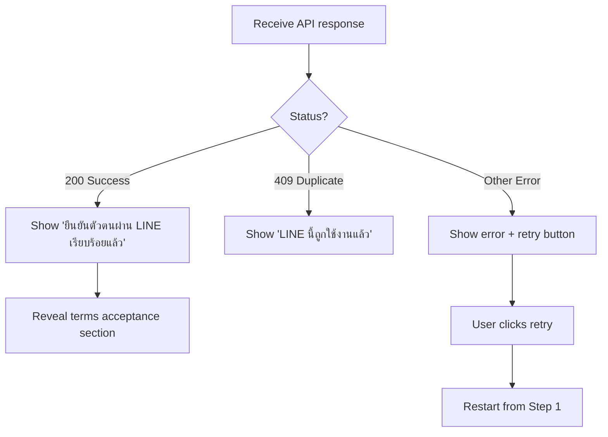

# LINE OAuth Callback Endpoint — Detailed Flow

## Overview

This document describes the complete LINE OAuth callback flow for mentee
registration. The flow involves 3 systems: the browser (frontend), LINE Platform
(external), and wise-api (backend + Firestore).

The callback URL is configured via `LINE_LOGIN_MENTEE_CALLBACK_URL` and points to
the frontend page (`/register/mentee/line-verification`). The frontend receives
the authorization code from LINE and forwards it to the backend, which exchanges
it for tokens server-side to keep `channelSecret` safe.

---

## Sequence Diagram



---

## Step-by-Step Breakdown

### Step 1 — User clicks the LINE verification button

**System:** Browser (Frontend)
**File:** `apps/wise-mentorship-web/src/routes/register/mentee/pages/MenteeLineVerificationPage.tsx`

The frontend builds a LINE authorization URL and redirects the user away from the
app entirely.

```typescript
const LINE_AUTH_URL = 'https://access.line.me/oauth2/v2.1/authorize'

function buildLineAuthUrl(channelId: string, callbackUrl: string, state: string) {
  const params = new URLSearchParams({
    response_type: 'code',
    client_id: channelId,
    redirect_uri: callbackUrl,
    scope: 'profile openid',
    state,
  })
  return `${LINE_AUTH_URL}?${params.toString()}`
}

// On button click:
const state = crypto.randomUUID()
sessionStorage.setItem('line_oauth_state', state)
window.location.href = buildLineAuthUrl(channelId, callbackUrl, state)
```

| Parameter | Value | Purpose |
|-----------|-------|---------|
| `response_type` | `code` | Request an authorization code (not token) |
| `client_id` | `LINE_LOGIN_CHANNEL_ID` | Identifies your LINE Login channel |
| `redirect_uri` | `LINE_LOGIN_MENTEE_CALLBACK_URL` | Where LINE sends the user back |
| `scope` | `profile openid` | Request profile + `id_token` with LINE user ID |
| `state` | Random UUID | CSRF protection — verified on callback |

---

### Step 2 — User approves on LINE

**System:** LINE Platform (external)

LINE shows its own consent screen. The user logs into LINE (if not already) and
approves the requested permissions. Your code has no control over this step.

---

### Step 3 — LINE redirects back to frontend

**System:** LINE Platform → Browser

LINE redirects the user back to your `redirect_uri`:

```
https://app.example.com/register/mentee/line-verification?code=abc123&state={same_state}
```

| Parameter | Description |
|-----------|-------------|
| `code` | One-time authorization code (~10 min expiry, single use) |
| `state` | Same value you sent in Step 1 — must be verified |

The page reloads at `MenteeLineVerificationPage`. A `useEffect` hook detects the
`code` and `state` parameters and proceeds:

```typescript
useEffect(() => {
  const params = new URLSearchParams(window.location.search)
  const code = params.get('code')
  const state = params.get('state')

  if (code && state) {
    const savedState = sessionStorage.getItem('line_oauth_state')
    if (state !== savedState) {
      setError('Invalid state parameter')
      return
    }

    submitLineCallback(code)
  }
}, [])
```

---

### Step 4 — Frontend sends code to backend

**System:** Browser → Backend

```typescript
POST /mentees/line/callback
Content-Type: application/json
Cookie: access_token=<JWT>

{ "code": "abc123" }
```

The frontend never exchanges the code for tokens itself. The `channelSecret` is
only available server-side.

---

### Step 5 — Backend exchanges code and binds account

**System:** Backend (`BindLineAccountUseCase`)
**Files:**
- Use case: `apps/wise-api/src/modules/mentee/application/use-cases/bind-line-account/`
- LINE service: `apps/wise-api/src/modules/line/infrastructure/services/http/http-line-login.service.ts`
- Controller: `apps/wise-api/src/modules/mentee/interface/rest/controllers/mentee.controller.ts`

This is the core logic, executed sequentially:

#### 5a. Validate mentee registration status

```typescript
const mentee = await this.menteeRepository.findByUserId(userId)
if (!mentee) throw new NotFoundException()

if (mentee.registrationStatus !== MenteeRegistrationStatus.PENDING_LINE_VERIFICATION) {
  throw new ConflictException('Invalid registration status for LINE binding')
}
```

#### 5b. Exchange authorization code for tokens

Uses the existing `HttpLineLoginService`:

```typescript
const tokens = await this.lineLoginService.getTokens(
  this.lineConfig.login.menteeCallbackUrl,
  code,
)
```

This makes a server-to-server call to LINE:

```
POST https://api.line.me/oauth2/v2.1/token
Content-Type: application/x-www-form-urlencoded

grant_type=authorization_code
&code=abc123
&redirect_uri={menteeCallbackUrl}
&client_id={channelId}
&client_secret={channelSecret}
```

LINE responds with:

```json
{
  "access_token": "eyJhbGciOi...",
  "token_type": "Bearer",
  "refresh_token": "...",
  "expires_in": 2592000,
  "scope": "profile openid",
  "id_token": "<JWT>"
}
```

#### 5c. Decode `id_token` to extract LINE user ID

The `id_token` is a JWT. Decoding its payload:

```json
{
  "iss": "https://access.line.me",
  "sub": "U1234567890abcdef",
  "aud": "<channel_id>",
  "exp": 1234567890,
  "iat": 1234567890,
  "name": "Display Name",
  "picture": "https://profile.line-scdn.net/..."
}
```

```typescript
const payload = JSON.parse(
  Buffer.from(tokens.id_token.split('.')[1], 'base64').toString()
)
const lineUserId = payload.sub  // "U1234567890abcdef"
```

> **Note:** No signature verification is needed because the token was received
> directly from LINE's API over HTTPS in a server-to-server call.

#### 5d. Check duplicate binding

```typescript
const existingUser = await this.userRepository.findByLineUserId(lineUserId)
if (existingUser && existingUser.id !== userId) {
  throw new ConflictException('This LINE account is already linked to another user')
}
```

This prevents the same LINE account from being bound to multiple users. Because
`lineUserId` is stored on the `User` entity (not on Mentee/Mentor), cross-role
uniqueness is automatic.

#### 5e. Save `lineUserId` on User entity

```typescript
const user = await this.userRepository.findById(userId)
user.lineUserId = lineUserId
await this.userRepository.update(user)
```

#### 5f. Advance mentee registration status

```typescript
mentee.registrationStatus = MenteeRegistrationStatus.PENDING_PROFILE_COMPLETION
await this.menteeRepository.save(mentee)
```

#### 5g. Return response

```typescript
return {
  success: true,
  registrationStatus: mentee.registrationStatus,
}
```

---

### Step 6 — Frontend updates UI

**System:** Browser



---

## Error Cases

| Error | HTTP Status | Cause | User Experience |
|-------|-------------|-------|-----------------|
| Wrong registration status | 409 | Mentee not in `PENDING_LINE_VERIFICATION` | Should not happen in normal flow |
| LINE token exchange failed | 502 | LINE API down or code expired | "เกิดข้อผิดพลาด กรุณาลองใหม่" + retry |
| Duplicate LINE binding | 409 | LINE account already linked to another user | "LINE นี้ถูกใช้งานแล้ว" |
| Invalid CSRF state | — | `state` param mismatch (frontend only) | "Invalid state parameter" |
| JWT auth missing/invalid | 401 | User not logged in | Redirect to login |

---

## Key Files

| Layer | File | Role |
|-------|------|------|
| Config | `apps/wise-api/src/config/line.config.ts` | `channelId`, `channelSecret`, `menteeCallbackUrl` |
| LINE Service (interface) | `apps/wise-api/src/modules/line/domain/services/line-login.service.ts` | `ILineLoginService.getTokens()` |
| LINE Service (impl) | `apps/wise-api/src/modules/line/infrastructure/services/http/http-line-login.service.ts` | Exchanges code for tokens via LINE API |
| User Entity | `apps/wise-api/src/modules/user/domain/entities/user.entity.ts` | Stores `lineUserId` |
| Mentee Entity | `apps/wise-api/src/modules/mentee/domain/entities/mentee.entity.ts` | `registrationStatus` transitions |
| Use Case | `apps/wise-api/src/modules/mentee/application/use-cases/bind-line-account/` | Orchestrates the full binding logic |
| Controller | `apps/wise-api/src/modules/mentee/interface/rest/controllers/mentee.controller.ts` | `POST /mentees/line/callback` |
| Frontend Page | `apps/wise-mentorship-web/src/routes/register/mentee/pages/MenteeLineVerificationPage.tsx` | OAuth redirect, callback handling, UI states |

---

## Security Considerations

1. **`channelSecret` stays server-side** — the frontend only sends the `code` to
   the backend; token exchange happens in `HttpLineLoginService`.
2. **CSRF protection via `state` parameter** — random value stored in
   `sessionStorage` before redirect, verified on callback.
3. **Authorization code is single-use** — LINE invalidates it after first
   exchange (~10 min expiry).
4. **Duplicate binding prevention** — `findByLineUserId` query before saving
   ensures one LINE account per user.
5. **JWT authentication required** — the callback endpoint requires a valid
   session (user must be logged in).
