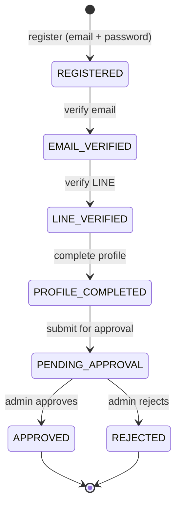

# Mentee Status Flow

## State Diagram

## Status Descriptions

| Status | Description |
|---|---|
| `REGISTERED` | Mentee has registered with email and password |
| `EMAIL_VERIFIED` | Mentee has verified their email address |
| `LINE_VERIFIED` | Mentee has verified their LINE account |
| `PROFILE_COMPLETED` | Mentee has completed their profile information |
| `PENDING_APPROVAL` | Mentee has submitted their profile for admin review |
| `APPROVED` | Admin has approved the mentee |
| `REJECTED` | Admin has rejected the mentee |
