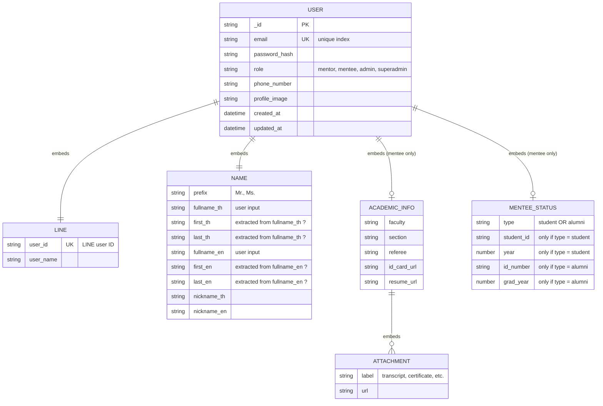
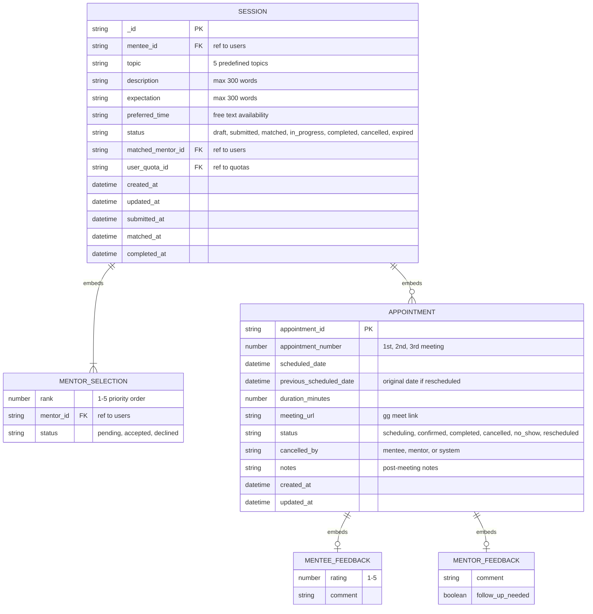

# Data Modeling – Mentee
This section will be seperated into 4 units. Register, Dashboard, Req Mentoring Session, Mentoring Session

## 1. Mentee Register
From firestore pricing consideration, we may embed the mentee data into 1 i/o


```json
{
    // Authentication
    "email": "string",
    "password_hash": "string",
    "role": "string",

    // LINE Integration
    "line": {
        "user_id": "string",
        "user_name": "string",
    },

    // Personal Information
    "name": {
        "prefix": "string",
        "first_th": "string",
        "last_th": "string",
        "first_en": "string",
        "last_en": "string",
        "nickname_th": "string",
        "nickname_en": "string"
    },

    "phone_number": "string",
    "profile_image": "string",

    // Academic Information
    "academic_info": {
        "faculty": "string",
        "section": "string",
        "referee": "string",
        "id_card_url": "string",
        "resume_url": "string",
        "attachments": [
            {
                "label": "string",
                "url": "string"
            }
        ]
    },

    // Mentee Status
    "mentee_status": {
        "type": "string",

        // Student-only
        "student_id": "string",
        "year": "number",

        // Alumni-only
        "id_number": "string",
        "grad_year": "number"
    },

    "created_at": "datetime",
    "updated_at": "datetime"
}

```


### Key Consideration – Feb 11, 2026
1. Line Payload [See More @line-dev](https://developers.line.biz/en/docs/basics/user-profile/#profile-information-types). I haven't added any LINE user information into this data types.
2. Embedding or Referencing

---

## 2. Session


```json
{
    // Session ID
    "_id": "ObjectId",
    "mentee_id": "ObjectId",
    // Basic Info
    "topic": "string",
    "description": "string",
    "expectation": "string",
    "preferred_time": "string",
    
    // Mentor Selection
    "mentor_selections": [
        {
            "rank": 1,
            "mentor_id": "ObjectId",
            "status": "string"
        }
    ],

    "status": "string",
    // Matched Mentor
    "matched_mentor_id": "ObjectId",

    // Mentee Quota
    "user_quota_id": "ObjectId",
    // Appointments
    "appointments": [
        {
            "appointment_id": "ObjectId",
            "appointment_number": 1,
            "scheduled_date": "datetime",
            "previous_scheduled_date": "datetime"
            "duration_minutes": "number",
            "meeting_url": "string",
            "status": "string",
            "cancelled_by": "string",
            "notes": "string",
            "mentee_feedback": {
                "rating": "number",
                "comment": "string"
            },
            "mentor_feedback": {
                "comment": "string",
                "follow_up_needed": "boolean"
            },
            "created_at": "datetime",
            "updated_at": "datetime"
        }
    ],

    // Metadata
    "created_at": "datetime",
    "updated_at": "datetime",
    "submitted_at": "datetime",
    "matched_at": "datetime",
    "completed_at": "datetime"
}

```





### Consideration
- Quota system >> Need ref due to frequent update?
- feedback has 3 points (ref from Figma)