# Data Modeling – Mentee
This section will be seperated into 4 units. Register, Dashboard, Req Mentoring Session, Mentoring Session

## 1. Mentee Register
From firestore pricing consideration, we may embed the mentee data into 1 i/o

```mermaid
erDiagram
    USER {
        string _id PK
        string email UK "unique index"
        string password_hash
        string phone_number
        string profile_image
        datetime created_at
        datetime updated_at
    }

    LINE {
        string user_id UK "LINE user ID"
        string user_name
        string profile_image
    }

    NAME {
        string prefix "Mr., Ms."
        string fullname_th "user input (source)"
        string first_th "extracted from fullname_th"
        string last_th "extracted from fullname_th"
        string fullname_en "user input (source)"
        string first_en "extracted from fullname_en"
        string last_en "extracted from fullname_en"
        string nickname_th
        string nickname_en
    }

    ACADEMIC_INFO {
        string faculty
        string section
        string referee
        string id_card_url
        string resume_url
    }

    ATTACHMENT {
        string label "transcript, certificate, etc."
        string url
    }

    MENTEE_STATUS {
        string type "student OR alumni"
        string student_id "only if type = student"
        number year "only if type = student"
        string id_number "only if type = alumni"
        number grad_year "only if type = alumni"
    }

    USER ||--|| LINE : "embeds"
    USER ||--|| NAME : "embeds"
    USER ||--|| ACADEMIC_INFO : "embeds"
    USER ||--|| MENTEE_STATUS : "embeds"
    ACADEMIC_INFO ||--o{ ATTACHMENT : "embeds"
```


```json
{
    // Authentication
    "email": "string",
    "password_hash": "string",

    // LINE Integration
    "line": {
        "user_id": "string",
        "user_name": "string",
        "profile_image": "string"
    },

    // Personal Information
    "name": {
        "prefix": "string",
        "first_th": "string",
        "last_th": "string",
        "first_en": "string",
        "last_en": "string",
        "nickname_th": "string",
        "nickname_en": "string"
    },

    "phone_number": "string",
    "profile_image": "string",

    // Academic Information
    "academic_info": {
        "faculty": "string",
        "section": "string",
        "referee": "string",
        "id_card_url": "string",
        "resume_url": "string",
        "attachments": [
            {
                "label": "string",
                "url": "string"
            }
        ]
    },

    // Mentee Status
    "mentee_status": {
        "type": "string",

        // Student-only
        "student_id": "string",
        "year": "number",

        // Alumni-only
        "id_number": "string",
        "grad_year": "number"
    },

    "created_at": "datetime",
    "updated_at": "datetime"
}

```


### Key Consideration – Feb 11, 2026
1. Line Payload [See More @line-dev](https://developers.line.biz/en/docs/basics/user-profile/#profile-information-types). I haven't added any LINE user information into this data types.
2. Embedding or Referencing

---

## 2. Session